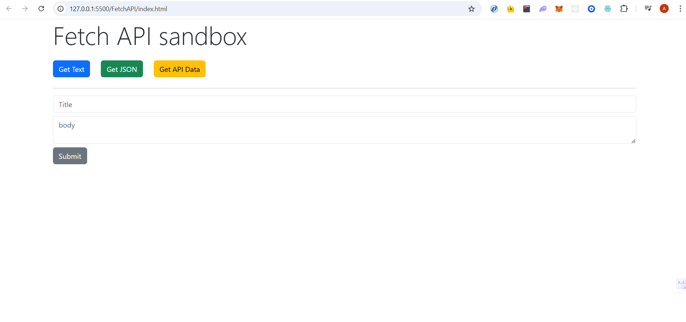
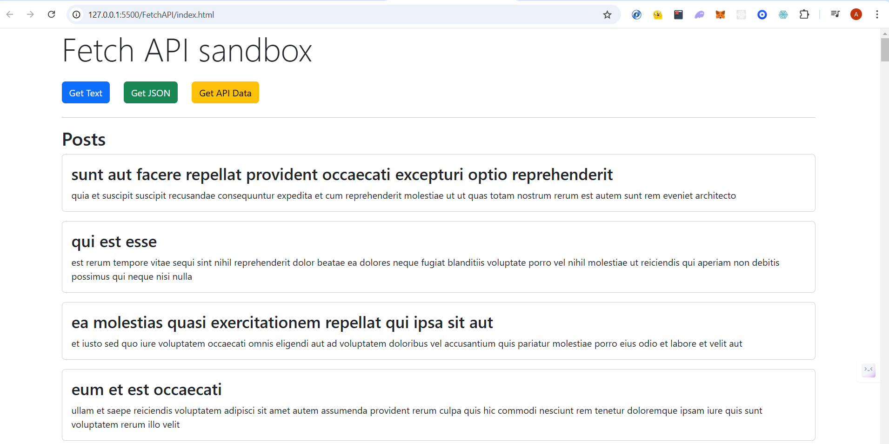

# Overview

A very basic javascript Fetch API Sandbox where I am fetching data from sample.txt file, sampleJSON.json file and JSONplaceholder API and also making a post request to JSONplaceholder API.

# Project Screenshots

## API Sandbox

## Data Fetched looks like this

